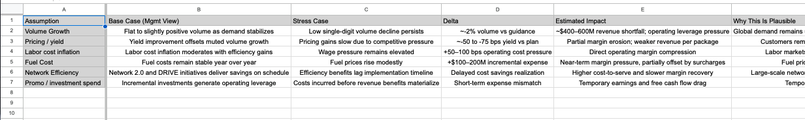
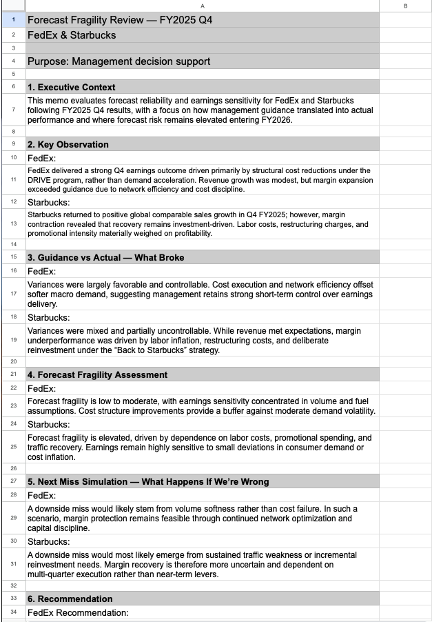

# Forecast Fragility Analysis  
**Where Management Guidance Breaks First**

**View-Only Model (Google Sheets):**  
https://docs.google.com/spreadsheets/d/1sB2QI01yXh4OXWMgRuGweWf8i5V5frPYRd5M93UYoek/edit?usp=sharing

---

## Business Question
Public company guidance drives investor expectations, internal budgets, and capital allocation decisions — yet forecasts often fail at macro and operating inflection points.

Earnings misses are frequently treated as surprises, even though the underlying assumptions become structurally fragile well before results are reported.

This project asks a forward-looking question:

**Where do corporate forecasts break first — and can those failures be identified before earnings misses occur?**

---

## Why This Matters
Forecast credibility sits at the center of FP&A, investor relations, and executive decision-making. When guidance fails, the issue is rarely a single bad quarter; it is usually the result of assumptions that became unstable as conditions changed.

Understanding *forecast fragility* — rather than simply tracking beats and misses — allows finance teams to:
- Identify where guidance risk is building
- Distinguish execution risk from demand risk
- Anticipate downside scenarios before they materialize

This analysis mirrors how FP&A and capital markets teams evaluate earnings risk beyond headline guidance.

---

## Analytical Framework
To assess forecast credibility and earnings risk, this project introduces a **Forecast Fragility Score**, a structured framework designed to evaluate how sensitive earnings outcomes are to small assumption errors.

The framework scores key guidance drivers across three dimensions:
- **Volatility** — how variable the underlying driver is
- **Controllability** — the degree to which management can influence outcomes
- **Forecast reliability** — historical accuracy and stability of the assumption

Rather than asking whether results beat or missed expectations, the framework evaluates **how fragile the assumptions were that produced those expectations**.

---

## Case Study Scope
The framework is applied to **FedEx** and **Starbucks** following FY2025 Q4 results to evaluate where future earnings risk is most likely to emerge.

---

## Key Findings

### FedEx — Lower Forecast Fragility
FedEx exhibits **low to moderate forecast fragility**, with recent earnings performance driven primarily by controllable internal levers:

- Structural cost reductions under the DRIVE program  
- Network efficiency improvements  
- Capital discipline and margin-focused execution  

While revenue growth remains modest, margin performance has proven resilient. Downside risk is more likely to emerge from external demand softness rather than internal execution failure, resulting in relatively stable guidance under moderate uncertainty.

---

### Starbucks — Elevated Forecast Fragility
Starbucks exhibits **elevated forecast fragility**, despite a return to positive global comparable sales growth in Q4 FY2025.

Earnings outcomes remain highly sensitive to:
- Labor cost inflation  
- Promotional intensity  
- Restructuring activity  
- Traffic recovery and consumer behavior  

As a result, earnings performance depends on multi-quarter execution and behavioral recovery rather than near-term controllable levers, increasing sensitivity to small assumption errors and raising the risk of forecast volatility.

---

## Key Insight
Forecast risk is **asymmetric across companies**, even when topline performance appears similar.

- FedEx’s earnings outlook is anchored by controllable cost and efficiency levers, producing more durable guidance  
- Starbucks remains in a transition phase where labor, promotions, and traffic recovery introduce materially higher sensitivity to assumption error  

By isolating where forecasts are most fragile, this framework allows planning teams and investors to distinguish between **durable guidance** and guidance that is structurally vulnerable to future misses.

---

## Decision Implications
- Forecast credibility should be evaluated based on assumption stability, not recent beats or misses  
- Guidance anchored to controllable levers is more resilient under uncertainty  
- FP&A teams should stress-test forecasts for fragility before committing to budgets or capital allocation decisions  
- Investors and leadership teams should treat fragile guidance with greater caution, even when near-term results appear stable  

This project demonstrates how earnings risk can be identified *before* misses occur by analyzing where assumptions are most sensitive.

---

## Repository Contents (At a Glance)
- `assets/` — Executive screenshots illustrating forecast fragility scoring and next-miss simulations  
- `memo/` — Executive summary outlining forecast fragility conclusions and guidance risk assessment  
- `README.md` — Project overview, analytical framework, and decision implications  

The primary analytical model is maintained in Google Sheets and linked above.

---

## Appendix: Model Screenshots (Executive Review Views)

*Screenshots reflect executive-level outputs used to assess forecast credibility and earnings risk.*

### Forecast Fragility Score (FedEx vs. Starbucks)

### FedEx — Next Miss Simulation

### Starbucks — Next Miss Simulation

### Internal Executive Memo View (Optional)

